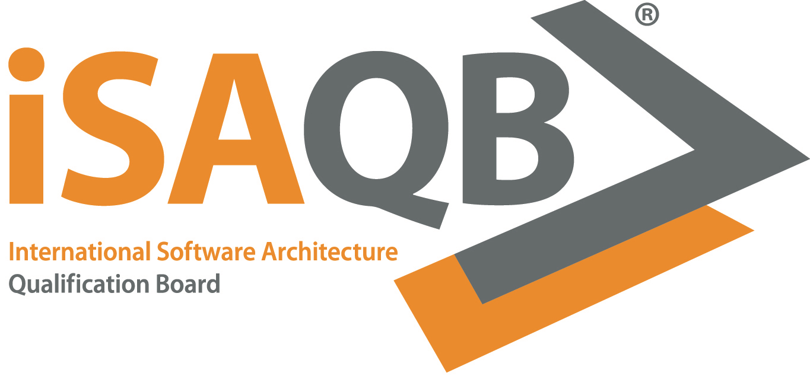

=  Advanced-Curriculum "Requirements for Architects"

The goal of this module is to equip architects with enough requirements know-how,
so that they can take educated architecture decisions, based on the real needs of stakeholders.

== Status
image:https://github.com/isaqb-org/curriculum-req4arc/actions/workflows/build_main.yml/badge.svg?branch=main["CI – Releases and Main"]
image:https://img.shields.io/github/last-commit/isaqb-org/curriculum-req4arc/main.svg["Last commit"]
image:https://img.shields.io/github/contributors/isaqb-org/curriculum-req4arc.svg["Contributors",link="https://github.com/isaqb-org/curriculum-req4arc/graphs/contributors"]
image:https://img.shields.io/github/issues/isaqb-org/curriculum-req4arc.svg["Issues",link="https://github.com/isaqb-org/curriculum-req4arc/issues"]
image:https://img.shields.io/github/issues-closed/isaqb-org/curriculum-req4arc.svg["Issues closed",link="https://github.com/isaqb-org/curriculum-req4arc/issues?utf8=%E2%9C%93&q=is%3Aissue+is%3Aclosed+"]

This is <<copyrighted,copyrighted work>>.

== Content
Architects and development teams often get only mediocre requirements as input for their work. 
The goal of this module is to equip architects with enough requirements know-how,
so that they can take educated architecture decisions, based on the real needs of stakeholders. They should either know how to elicit requirements (in agile and iterative approaches) or - at least - to know what to ask from others in their environment.

== How to contribute or participate
Create an issue, a merge- or pull-request.

== How to build locally

Prerequisite: https://docs.docker.com/get-docker/[Docker]. Nothing else — no JDK, no Ruby.

Clone the repository (with submodules, for the license text):

[source,shell]
----
git clone git@github.com:isaqb-org/REPO-NAME.git --recursive
----

If you already cloned without `--recursive`, run `git submodule update --init --recursive`.

Build all languages and formats:

[source,shell]
----
./curriculum-build.sh        # Linux / macOS
curriculum-build.bat         # Windows
----

Build a single output — pass the format and language (and optionally a variant):

[source,shell]
----
./curriculum-build.sh pdf DE          # Linux / macOS
./curriculum-build.sh html EN
./curriculum-build.sh pdf DE REMARKS
----

[source,bat]
----
curriculum-build.bat pdf DE           rem Windows
curriculum-build.bat html EN
curriculum-build.bat pdf DE REMARKS
----

Output is written to `build/`, named `<CURRICULUM_FILE>-<lang>.pdf` / `.html`, together
with an `index.html` overview page. The launcher pulls the builder image on first run and
reuses it afterwards.

=== Build configuration

`build.config` in the repository root holds the per-curriculum settings:

[cols="1,3a",options="header"]
|===
|Key |Meaning

|`CURRICULUM_FILE` |AsciiDoc root in `docs/` (without `.adoc`); also the output file name.
|`LANGUAGES`       |Space-separated languages to build. Default `DE EN`; drop one for a single-language curriculum.
|`SUFFIX_TAGS`     |Space-separated extra build variants, exposed as the `{suffix}` attribute. Empty = single build.
|`PREPRESS`        |PDF print/book layout (recto chapter starts + binding margins). `true` / `false`.
|===

Any key can be overridden for a single run via an environment variable, e.g.
`LANGUAGES="DE" ./curriculum-build.sh`.

== Maintainers

This repository is currently maintained by Gernot Starke.

[[copyrighted]]
== Licensing and Copyright

include::license-copyright/LICENSE.adoc[]
